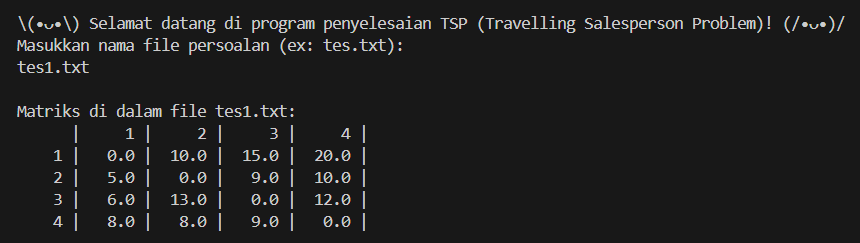
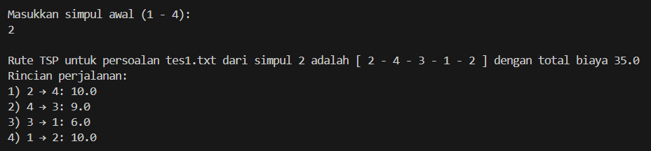
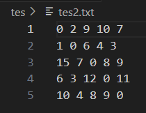
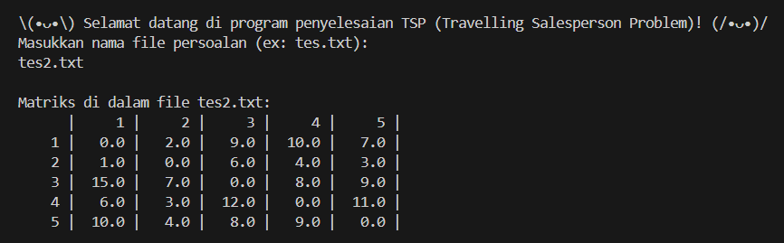
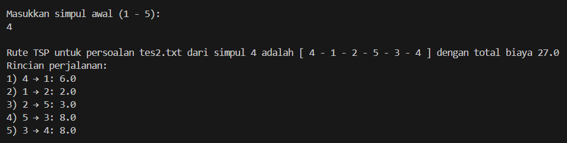
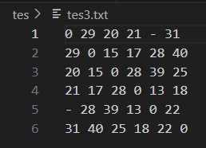
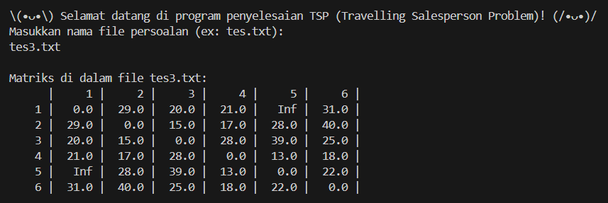
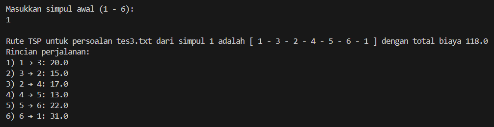

# Tugas Tantangan IF2211 Strategi Algoritma
# Program Dynamic Programming untuk Persoalan Travelling Salesperson Problem (TSP)

Program bertujuan untuk mencari solusi dari persoalan _Travelling Salesperson Problem_ (TSP) menggunakan pendekatan _Dynamic Programming_ berdasarkan masukan sebuah _adjacency matrix_ dan menghasilkan keluaran rute yang dapat dilalui dengan total biaya terkecil. Program dibentuk menggunakan bahasa pemrograman Ruby sebagai pemenuhan tugas tambahan mata kuliah IF2211 Strategi Algoritma.

## Requirements
Untuk dapat menjalankan program, pastikan perangkat Anda memiliki:
1. Ruby (Download: [Ruby](https://www.ruby-lang.org/en/))

## Cara Menjalankan Program
1. Lakukan _clone_ terhadap repositori ini menggunakan _code_ berikut:
```shell
git clone https://github.com/rafenmaxxx/TugasTantangan_13523031.git
```
2. Pastikan Anda telah berada pada direktori hasil _clone_ repositori.
3. Jalankan program dengan menjalankan _command_ berikut:
```shell
ruby tsp.rb
```
4. Program telah berhasil dijalankan dan siap untuk Anda gunakan! ٩(^ᗜ^ )و ´-

## Overview Program
Program menerima masukan file .txt di dalam folder tes sebagai _matrix adjacency_ yang merepresentasikan bobot antara dua simpul yang berhubungan. Program menggunakan prinsip optimalitas dalam pendekatan _dynamic programming_ dengan meninjau setiap urutan kombinasi simpul dan membandingkan setiap kemungkinan untuk mendapatkan biaya minimum di setiap tahapan rute. Dengan cara ini, program secara efisien dapat menentukan rute dengan total biaya minimum dalam melewati setiap simpul dalam graf.

_test case_ 1:




_test case_ 2:




_test case_ 3:




## Contributor
| Nama | NIM |
|------|-----|
| 13523031 | Rafen Max Alessandro |